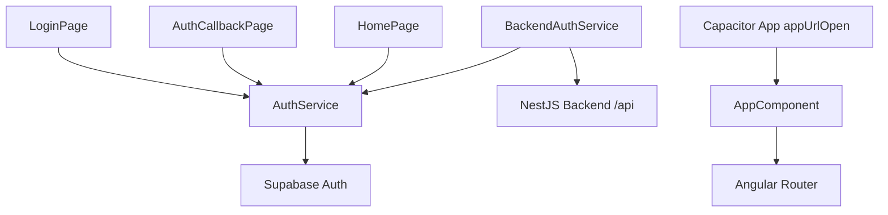
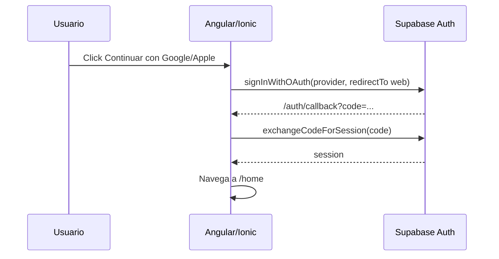
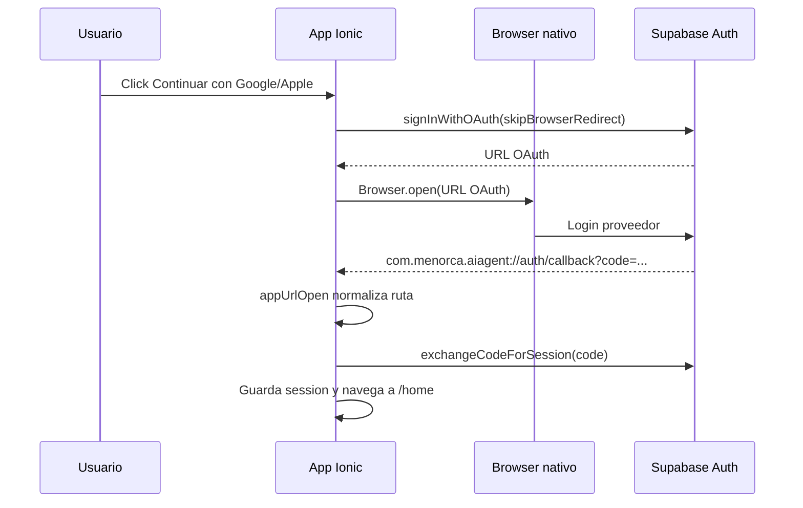
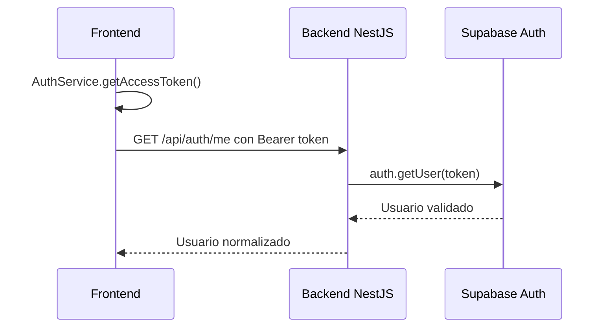

# Arquitectura Frontend

## Arquitectura general

El frontend es una app Ionic/Angular standalone para Menorca AI Agent. Su primer
bloque funcional implementa autenticacion con Supabase Auth usando Google y
Apple, callback web y deep link nativo para Android/iOS.

La app sigue una organizacion por features y servicios compartidos:

```txt
src/app
  auth       Pantallas de login y callback OAuth
  core       Servicios reutilizables, estado y clientes
  home       Primera pantalla despues de login
```



## Tecnologias utilizadas

- Angular 20 standalone components.
- Ionic Angular 8.
- Capacitor 8.
- Capacitor App para deep links.
- Capacitor Browser para abrir OAuth en navegador del sistema.
- Supabase JS SDK.
- Angular Signals (`signal`, `computed`) para estado de auth.
- Angular Router lazy routes.
- Karma/Jasmine para unit tests.
- ESLint para lint.
- Playwright CLI para validacion visual.
- Android Gradle project generado por Capacitor.
- iOS Xcode project generado por Capacitor.

## Lo que ya esta hecho

- Ruta `/login`.
- Ruta `/auth/callback`.
- Ruta `/home`.
- Login con Google.
- Login con Apple.
- Botones con logos visibles de Google y Apple.
- OAuth PKCE con Supabase.
- Callback web: `http://localhost:8100/auth/callback`.
- Callback nativo: `com.menorca.aiagent://auth/callback`.
- Deep link Android configurado en `AndroidManifest.xml`.
- URL Scheme iOS configurado en `Info.plist`.
- `AuthService` para session state, login, callback, logout y access token.
- `BackendAuthService` para llamar backend con bearer token.
- Home inicial con estado de sesion.
- README y pruebas.

## Flujo de datos

### OAuth web



### OAuth en dispositivo fisico



### Llamada protegida al backend



## Estructura de carpetas

```txt
src
  app
    app.component.ts
    app.routes.ts
    auth
      callback
        auth-callback.page.ts/html/scss/spec.ts
      login
        login.page.ts/html/scss/spec.ts
    core
      auth
        auth.service.ts
        auth.types.ts
        backend-auth.service.ts
    home
      home.page.ts/html/scss/spec.ts
  environments
    environment.ts
    environment.prod.ts
android
  app/src/main/AndroidManifest.xml
ios
  App/App/Info.plist
```

## Como se comunican los modulos

- `AppComponent` escucha `App.addListener('appUrlOpen')` para deep links.
- `AppComponent` convierte `com.menorca.aiagent://auth/callback?...` en ruta
  Angular `/auth/callback?...`.
- `AuthCallbackPage` llama `AuthService.completeOAuthCallback()`.
- `LoginPage` llama `AuthService.signInWithProvider('google' | 'apple')`.
- `HomePage` lee signals de `AuthService` y permite logout.
- `BackendAuthService` lee `AuthService.getAccessToken()` y llama al backend.

## Configuracion

Environment actual:

```ts
apiUrl: 'http://localhost:3000'
supabaseUrl: 'https://ocwakwtzliledabccvgc.supabase.co'
supabasePublishableKey: 'sb_publishable_...'
authRedirectUrl: 'http://localhost:8100/auth/callback'
nativeAuthRedirectUrl: 'com.menorca.aiagent://auth/callback'
allowedAuthProviders: ['google', 'apple']
```

Redirect URLs requeridas en Supabase:

```txt
http://localhost:8100/auth/callback
com.menorca.aiagent://auth/callback
```

## Tecnologias previstas pero aun no implementadas

- Onboarding completo.
- Home con clima, buses, restaurantes y supermercados.
- Chat del agente turistico.
- Voz con STT/TTS.
- Cuotas guest/user/paid.
- Stripe checkout.
- Ratings de lugares y agente.
- Alarmas/notificaciones.
