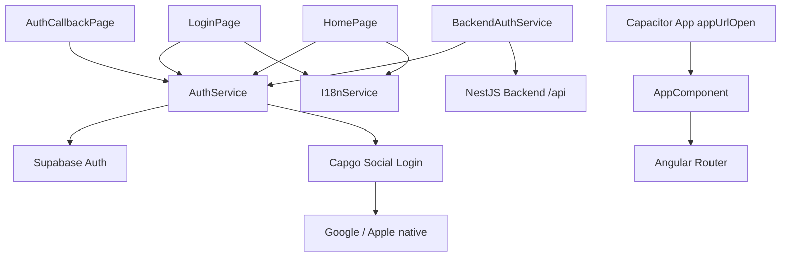
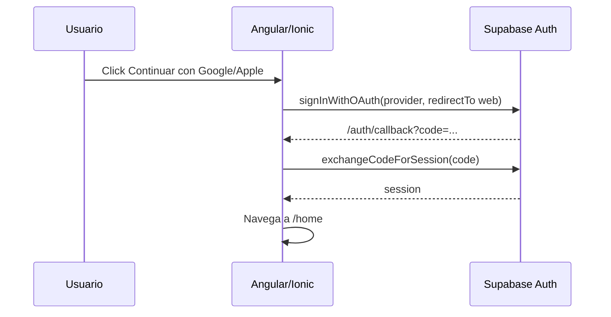
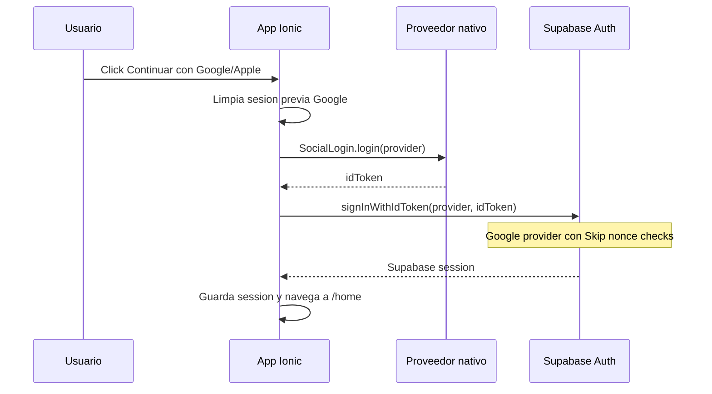
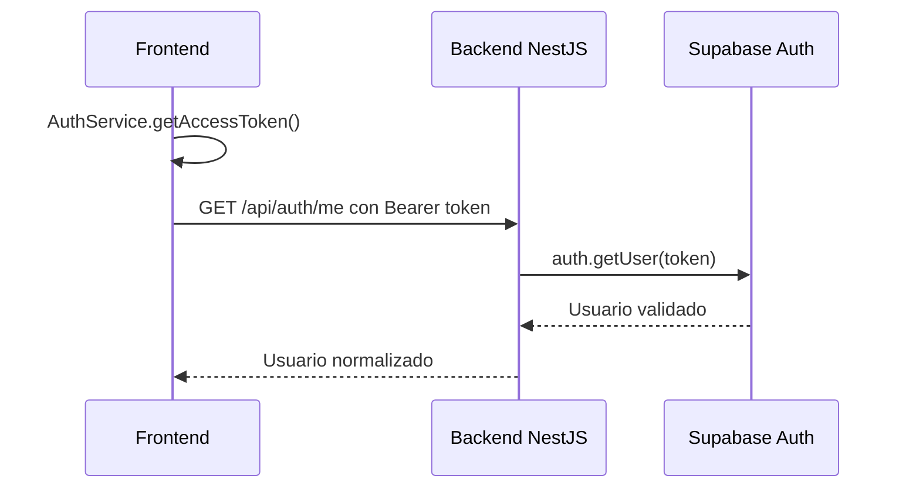

# Arquitectura Frontend

## Arquitectura general

El frontend es una app Ionic/Angular standalone para Menorca AI Agent. Su primer
bloque funcional implementa autenticacion con Supabase Auth usando Google y
Apple. En web usa OAuth PKCE; en dispositivo fisico usa login nativo del
proveedor y entrega el `idToken` a Supabase.

La app sigue una organizacion por features y servicios compartidos:

```txt
src/app
  auth       Pantallas de login y callback OAuth
  core       Servicios reutilizables, estado y clientes
    i18n     Internacionalizacion runtime por idioma del dispositivo
  home       Primera pantalla despues de login
```



## Tecnologias utilizadas

- Angular 20 standalone components.
- Ionic Angular 8.
- Capacitor 8.
- Capacitor App para deep links.
- Capgo Capacitor Social Login para Google/Apple nativo.
- Supabase JS SDK.
- Angular Signals (`signal`, `computed`) para estado de auth.
- I18n runtime propio con Angular Signals para detectar `navigator.languages`.
- Angular Router lazy routes.
- Karma/Jasmine para unit tests.
- ESLint para lint.
- Playwright CLI para validacion visual.
- Android Gradle project generado por Capacitor.
- iOS Xcode project generado por Capacitor.

## Lo que ya esta hecho

- Ruta `/login`.
- Ruta `/auth/callback`.
- Ruta `/home`.
- Login con Google.
- Login con Apple.
- Botones con logos visibles de Google y Apple.
- OAuth PKCE con Supabase.
- Login nativo Google/Apple con `signInWithIdToken`.
- Callback web: `http://localhost:8100/auth/callback`.
- Callback nativo iOS: `com.danny-armijos.menorca-ai-agent://auth/callback`.
- Callback nativo Android: `com.menorca.aiagent://auth/callback`.
- Deep link Android configurado en `AndroidManifest.xml`.
- URL Scheme iOS configurado en `Info.plist`.
- Firebase nativo integrado con `android/app/google-services.json` y
  `ios/App/App/GoogleService-Info.plist`.
- `AuthService` para session state, login, callback, logout y access token.
- `BackendAuthService` para llamar backend con bearer token.
- Home turistico con clima, inspiracion, buses, gastronomia, suministros,
  recomendacion, FAB del agente IA y navegacion inferior.
- Diseno de login/home extraido desde el MCP de Stitch para el proyecto
  `Menorca AI Travel Guide`, tema `Balearic Horizon`.
- Internacionalizacion runtime en Login/Home con soporte `es`, `en` y `ca`.
- README y pruebas.

## Flujo de datos

### OAuth web



### Login nativo en dispositivo fisico



### Llamada protegida al backend



## Estructura de carpetas

```txt
src
  app
    app.component.ts
    app.routes.ts
    auth
      callback
        auth-callback.page.ts/html/scss/spec.ts
      login
        login.page.ts/html/scss/spec.ts
    core
      auth
        auth.service.ts
        auth.types.ts
        backend-auth.service.ts
      i18n
        i18n.service.ts
        i18n.types.ts
        translations.ts
    home
      home.page.ts/html/scss/spec.ts
  environments
    environment.ts
    environment.prod.ts
android
  app/src/main/AndroidManifest.xml
ios
  App/App/App.entitlements
  App/App/Info.plist
```

## Como se comunican los modulos

- `AppComponent` escucha `App.addListener('appUrlOpen')` para deep links.
- `AppComponent` convierte los schemes nativos iOS/Android en ruta Angular
  `/auth/callback?...`.
- `AuthCallbackPage` llama `AuthService.completeOAuthCallback()`.
- `LoginPage` llama `AuthService.signInWithProvider('google' | 'apple')`.
- `HomePage` lee signals de `AuthService` y permite logout.
- `BackendAuthService` lee `AuthService.getAccessToken()` y llama al backend.

## Configuracion

Environment actual:

```ts
apiUrl: 'http://localhost:3000'
supabaseUrl: 'https://ocwakwtzliledabccvgc.supabase.co'
supabasePublishableKey: 'sb_publishable_...'
authRedirectUrl: 'http://localhost:8100/auth/callback'
nativeAuthRedirectUrl: 'com.danny-armijos.menorca-ai-agent://auth/callback'
googleWebClientId: '804358190687-071h3gve8rt605sc8m05igqrp0tdr5dg.apps.googleusercontent.com'
googleIosClientId: '804358190687-1jgo41tfqn5bvcsh7o1n6bt1nhn8kg5e.apps.googleusercontent.com'
appleClientId: 'com.danny-armijos.menorca-ai-agent'
appleRedirectUrl: 'https://ocwakwtzliledabccvgc.supabase.co/auth/v1/callback'
allowedAuthProviders: ['google', 'apple']
```

Redirect URLs requeridas en Supabase:

```txt
http://localhost:8100/auth/callback
com.menorca.aiagent://auth/callback
com.danny-armijos.menorca-ai-agent://auth/callback
```

Configuracion Firebase nativa:

```txt
Firebase project: master-ia-83f09
Android package: com.menorca.aiagent
iOS bundle: com.danny-armijos.menorca-ai-agent
```

Pendiente para Google Sign-In Android: regenerar `google-services.json` si se
necesita que Android incluya `oauth_client`.

Estado actual de Google:

```txt
Web Client ID: 804358190687-071h3gve8rt605sc8m05igqrp0tdr5dg.apps.googleusercontent.com
Android debug SHA-1: 66:D6:73:71:E5:C2:66:48:AF:61:39:A7:1C:25:0D:1E:F5:54:67:19
iOS Client ID: 804358190687-1jgo41tfqn5bvcsh7o1n6bt1nhn8kg5e.apps.googleusercontent.com
iOS reversed client ID: com.googleusercontent.apps.804358190687-1jgo41tfqn5bvcsh7o1n6bt1nhn8kg5e
iOS Info.plist Google keys: GIDClientID, GIDServerClientID
Google nonce: no se envia en login nativo; Supabase Google provider usa Skip nonce checks para iOS
Estado dispositivo iOS: Google y Apple autentican correctamente con Supabase Auth
```

## Tecnologias previstas pero aun no implementadas

- Onboarding completo.
- Datos reales de clima, buses, restaurantes y supermercados.
- Chat del agente turistico.
- Voz con STT/TTS.
- Cuotas guest/user/paid.
- Stripe checkout.
- Ratings de lugares y agente.
- Alarmas/notificaciones.
